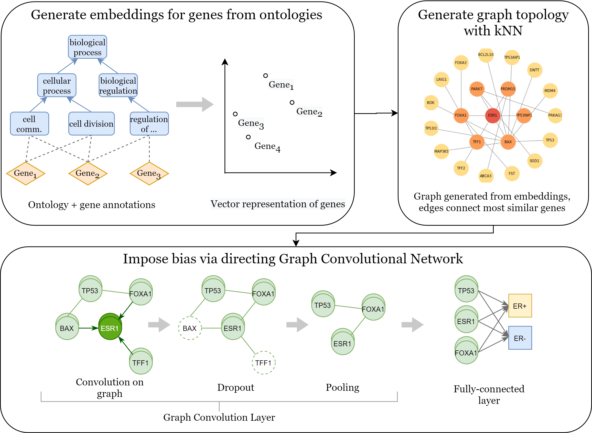

# Using ontology embeddings for structural inductive bias in gene expression data analysis

Stratifying cancer patients based on their gene expression levels allows improving diagnosis, survival analysis and treatment planning. However, such data isextremely highly dimensional as it contains expression values for over 20000 genesper patient, and the number of samples in the datasets is low. To deal with such settings, we propose to incorporate prior biological knowledge about genes from ontologies into the machine learning system for the task of patient classification given their gene expression data. We use ontology embeddings that capture the semantic similarities between the genes to direct a Graph Convolutional Network, and therefore sparsify the network connections. We show this approach provides anadvantage for predicting clinical targets from high-dimensional low-sample data.


## The main pipeline



## Code overview

The first approach uses the ontology embedding for the genes as a similarity measure  for  knowledge-informed  feature  selection.   Given  reference  genes known as an important factor in prediction, one can use the ontology-based similarity  to  select  a  larger  set  of  genes  performing  better  on  the  patient classification task. See `feature_selecton_notebooks` for experiments.

The  second  approach  incorporates  ontology-based  knowledge  about  genes into  deep  learning  model  as  a  structural  inductive  bias.   By  using  GraphConvolutional Networks (see `models/GCN.py`), the information about gene similarity can be used to impose a biological bias on the model, in the same way as convolutional network impose a spatial bias on the image. See `experiments` and `notebooks` for experiments. 


## Reference 
If you find our work useful, please cite:
```
@article{onto-gcn,
  title={Using ontology embeddings for structural inductive bias in gene expression data analysis},
  author={Tr{\k{e}}bacz, Maja and Shams, Zohreh and Jamnik, Mateja and Scherer, Paul and Simidjievski, Nikola and Terre, Helena Andres and Li{\`o}, Pietro},
  journal={Machine Learning in Computational Biology (MLCB)},
  year={2020}
}
```

## Acknowledgement
This repository is a fork and an extension of: [gene-graph-conv repository](https://github.com/mila-iqia/gene-graph-conv) corresponding to the [Dutil et al.](https://arxiv.org/pdf/1806.06975.pdf).
